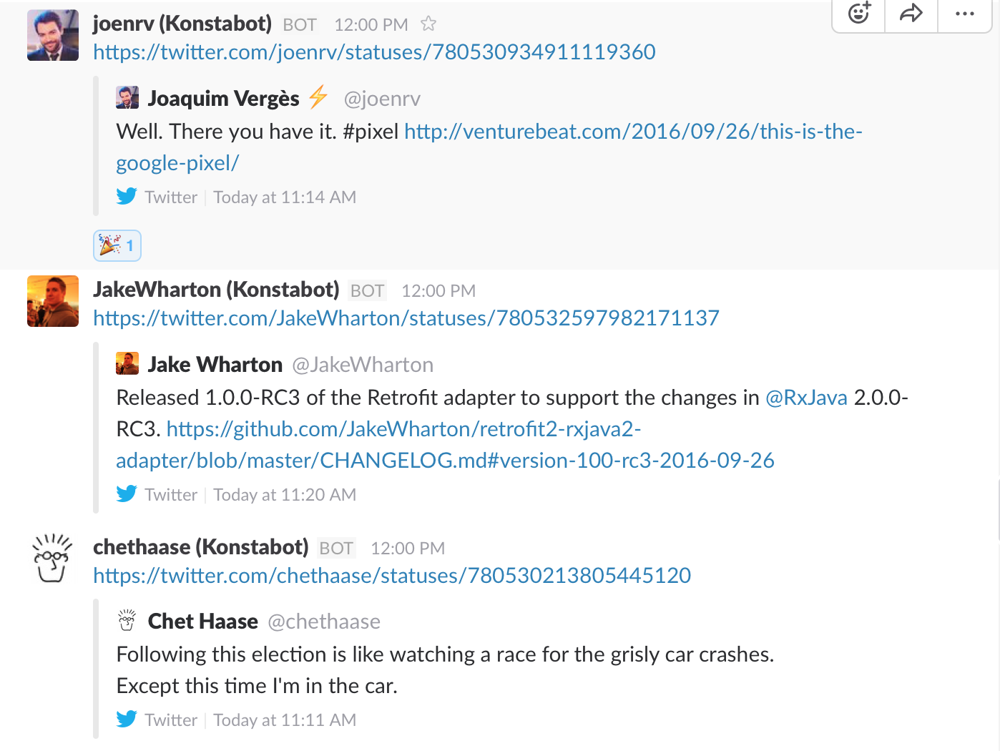

# twitter-list-to-slack (Konstabot)

Konstabot is a tool that will extract the most popular posts from a Twitter List and post them to a Slack channel.

This can be a more useful Slack integration than something that pulls out every tweet for every user you specify. Konstabot can optionally apply a blacklist of keywords to ignore, filter out retweets, and specify a minimum number of likes or retweets.

Script usage (will run the script once):

    bundle install # first-time setup
    ruby konstabot.rb # will print out instructions
    
## Example

Example `config.xml` will point to my Twitter account for a list of Android-related Twitter users. This is what the output will look like in Slack:

## 1. Configure Twitter API integration

### 1.1 Twitter Auth Tokens
You need some Twitter OAuth tokens to be able to use the Twitter API to read from a list. This needs to be associated with a Twitter account, but the application only needs "Read Only" access, it does not attempt to post anything on your behalf.

* [Create a Twitter application](https://apps.twitter.com/)
* On the Twitter application page, click "Keys and Access Tokens"
* Create the consumer key and secret
* Under the "Your Access Token" section, create an access token and grant access
* Make sure you set the "Access Level" to "Read Only" for this application

### 1.2 Create a configurations.yml

Create a `configurations.yml` at the root of the project, at the same level as the `konstabot.rb` file:

    consumer_key: # Copy your Twitter Consumer Key from the steps above into here
    consumer_secret: # Copy your Twitter Secret from the steps above into here
    token: # Copy your Twitter Access Token from the steps above into here
    secret: # Copy your Twitter Access Token Secret from the steps above into here
    slack_webhooks_uri: # This can be added later
    
This file is not part of the git repository and should not be shared.

## 2. Configure Twitter List
Pick the list that you want to follow. If the list is private, then the setup steps for Twitter API above need to link to the same account to which the private list belongs to. While public lists can be read from any Twitter account.

Edit `config.yml` to set `twitter_user` to the Twitter handle of the user that owns the list, and set `twitter_list` to the list slug from the list's URL.

e.g. For https://twitter.com/k_tcher/lists/android:

    twitter_user: 'k_tcher'
    twitter_list: 'android'

## 3. Other settings and Dry Run
Try out your set up with a dry run:

    ruby konstabot.rb -n 10 -d
    
A dry run will not send anything to Slack yet. You can tune the other settings in `config.yml` before you start posting to Slack.

## 4. Set up Slack integration

[Set up a Slack Incoming Webhook](https://api.slack.com/custom-integrations) and paste the URL into `configurations.yml`

Set the bot name to match the Slack user name in `config.xml` (this is just a string, script will not fail if you don't change the name).

The script will now post to the specified Slack channel whenever you run it, unless `-d` (`--dry-run`) is specified as a parameter.

## 5. Timed job

You can setup the script to be run periodically - such as every hour Monday-Friday 9-5pm. This is to be done outside of the script using a different script or your OS settings.

For example on Mac OS X, you can set a cron job using `crontab -e`:

    */60 9-17 * * 1-5 cd <your checkout directory> && <path to ruby>/ruby konstabot.rb -n 10
   
[See Apple's Documentation](https://developer.apple.com/library/content/documentation/MacOSX/Conceptual/BPSystemStartup/Chapters/ScheduledJobs.html) for more details on this example.

# LICENSE

Apache 2.0, see [LICENSE](LICENSE) for full details.
